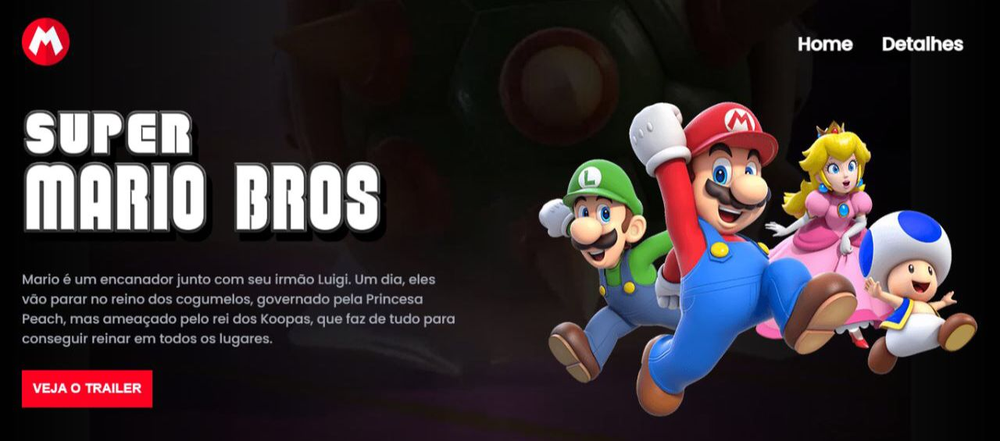

<h1 align="center"> Super Mario Bros - O filme </h1>

  <a href="#-tecnologias">Tecnologias</a>     |    
  <a href="#-projeto">Projeto</a>     

 

  

##  🚀 Tecnologias

Esse projeto foi desenvolvido com as seguintes tecnologias:

- HTML e CSS
- JavaScript
- Git e Github

##  💻 Projeto

Uma tela onde mostro um pouco sobre o filme - Super Mario Bros.
